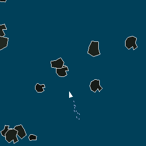

# Hello #

  
This is an asteroids clone developmed using `cl-opengl`.

For now, just running `(ql:quickload :cl-game)` should be enough to get going.

Then, to start the game, go to asteroids.lisp and run `(game-loop)`.

# Current TODOs #

+ Add visual effect (= "exhaust") when thrusting
+ Figure out units of length

# Less Important TODOs #
+ Change ship color depending on state
+ Move vector math to separate package
+ Move Top Level API (game-loop) to separate package
